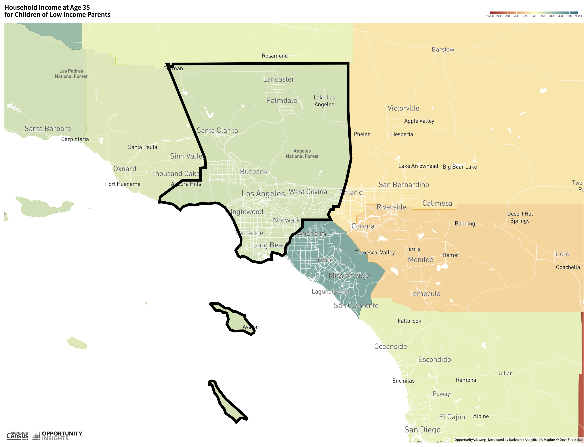
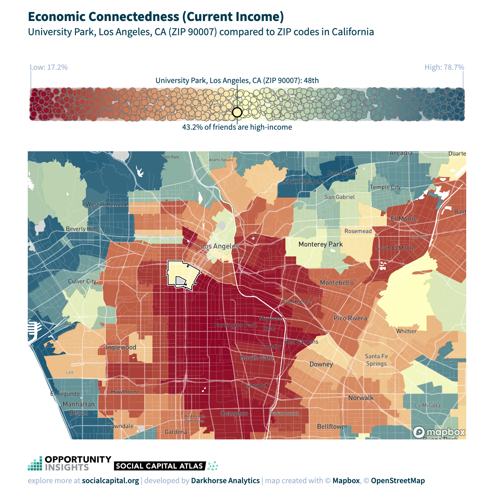
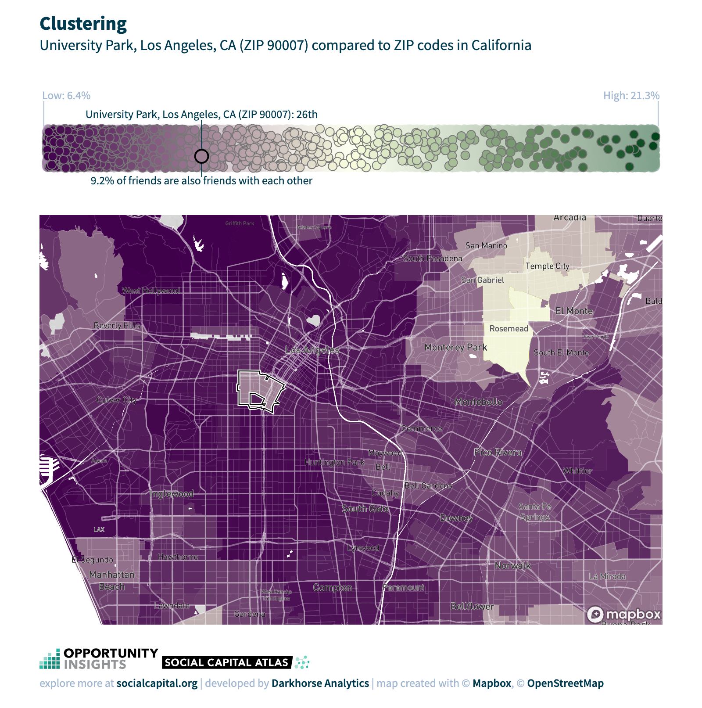
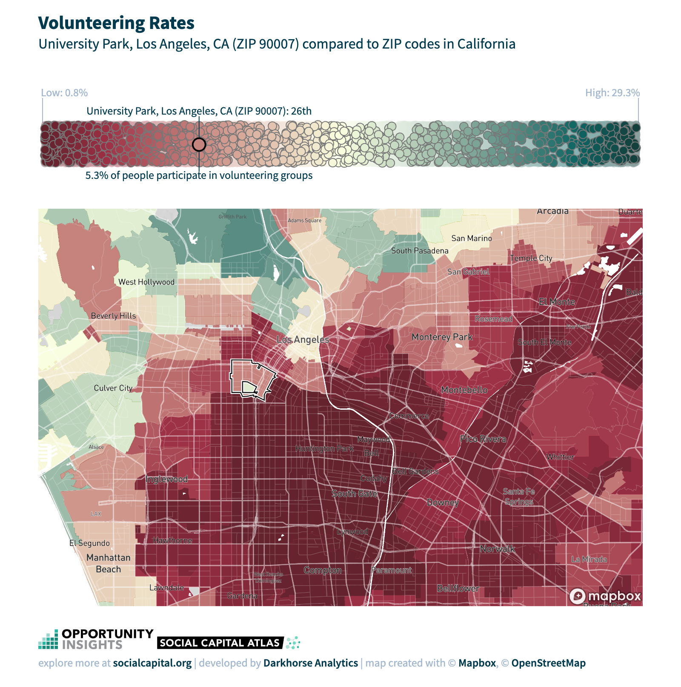

```{r}
#clear the workspace
rm(list=ls()) # removes all objects from the environment
cat('\014') # clears the console

#Install package and library
if (!require(haven)) install.packages("haven"); library(haven) 
if (!require(ggplot2)) install.packages("ggplot2"); library(ggplot2)
if (!require(tidyverse)) install.packages("tidyverse"); library(tidyverse)
```
```{r}
#Change working directory and load stata data set
atlas <- read_dta("/Users/mariapkartika/Documents/Ec50/Empirical Project/atlas.dta")
```


## Question 1
For this project, I chose Los Angeles County, CA, as my community to explore.

{ width=50% }


## Question 2
### 2a.What are the units that this variable is measured in?
Answer: The variable kfr_pooled_pooled_p25 is measured in percentiles. Specifically, it measured the expected income rank percentile of kids whose parents are below the 25th percentile of the household income rank.

### 2b. Do higher or lower values correspond to higher upward mobility?
Answer: Higher values of kfr_pooled_pooled_p25 correspond to higher upward mobility. This is because the statistic measures the difference between a child's income percentile and their parents' income percentile, given the child's parents were at the 25th percentile of the income distribution. A higher value of the statistic indicates that a child from a lower-income family has a higher chance of moving up the income ladder compared to their parents.

### 2c. Explain briefly why this statistic is estimated using a linear statistical model.
Answer: A linear statistical model to model the relationship between parents' income and children's income is used because of the assumption that there is a linear relationship between the two variables, meaning that a change in one variable is associated with a proportional change in the other.

## Question 3
```{r}
# Histogram of kfr_pooled_pooled_p25
ggplot(atlas) + geom_histogram(aes(x=kfr_pooled_pooled_p25, y=..density..), bins = 50)
```
The observations in the variable kfr_pooled_pooled_p25 has a mild right skewed distribution.

## Question 4
```{r}
# Summary stats (mean, SD, min, and max) for kfr_pooled_pooled_p25
summary (atlas$kfr_pooled_pooled_p25)
```

```{r}
# Mean
mean (atlas$kfr_pooled_pooled_p25, na.rm = TRUE)
```

```{r}
# Standard Deviation
sd (atlas$kfr_pooled_pooled_p25, na.rm = TRUE)
```
From the results, there is 1189 missing values (NA's)

## Question 5
Answer: The kfr_pooled_pooled_p25 variable is estimated using a linear statistical model which may have several limitations, such as inability to capture all the complex factors that affect a child's income, sensitivity to outliers and influential observations, or requiring for errors to be normally distributed and have constant variance across the range of the predictor variables. If these assumptions are violated, it may lead to the predicted income percentile of a child based on their parent's income percentile falling outside the expected range of 0 to 100. The predicted income percentile may be negative, indicating that the child is expected to have a lower income than their parent, or greater than 100, suggesting that the child is expected to have a higher income than their parent, on average.


## Question 6
Census Tract chosen: **Tract 06037206010, Central LA, Los Angeles, CA**
```{r}
# Calculating mean of kfr_pooled_pooled_p25 in the USA
mean (atlas$kfr_pooled_pooled_p25, na.rm = TRUE)
```

```{r}
# Generate new subset of California
california <- subset (atlas, state == 06)

#Calculating mean of california 
mean (california$kfr_pooled_pooled_p25, na.rm = TRUE)
```
```{r}
#Subset observations to the county (tract)
tract <- subset (california, county == 037 & tract == 206010)

#Calculating mean of california 
mean (tract$kfr_pooled_pooled_p25, na.rm = TRUE)
```

Answer: The mean of kfr_pooled_pooled_p25 in my census tract (48.35) is higher than the state of California (44.81) and the US (42.86). This suggests that children in my census tract are expected to have higher income percentiles, or have better chances of climbing the income ladder, than children in other areas of the US and California with similar parental income backgrounds.


## Question 7
```{r}
# Calculating SD of kfr_pooled_pooled_p25 in the USA
sd (atlas$kfr_pooled_pooled_p25, na.rm = TRUE)
```
```{r}
#Calculating SD of california 
sd (california$kfr_pooled_pooled_p25, na.rm = TRUE)
```
```{r}
# Generate subset of county 
lacounty <- subset (atlas, state == 06 & county == 037)
```
```{r}
#Calculating mean of california 
sd (lacounty$kfr_pooled_pooled_p25, na.rm = TRUE)
```
Answer: The standard deviation of my county (6.08) is higher than the state SD (5.96) but lower than the national SD (7.13). Comparing the standard deviations of kfr_pooled_pooled_p25 can provide insights into the variation in income mobility across different geographic areas. A higher standard deviation suggests greater variation in income mobility. In this case, the standard deviation of kfr_pooled_pooled_p25 in my county is higher than the state SD but lower than the national SD, suggesting that there may be greater variation in income mobility within my county compared to the state, but less variation compared to the entire U.S.


## Question 8
### 8a. Draw a scatter plot within home county
```{r}
#Draw binscatter plot of home county (LA) with kfr_pooled_pooled_p25 as Y-axis and rent_twobed2015 (X-asis)
ggplot(data = lacounty) + geom_point(aes(x = rent_twobed2015, y = kfr_pooled_pooled_p25)) +
geom_smooth(aes(x = rent_twobed2015, y = kfr_pooled_pooled_p25), method = "lm", se = F) +geom_text(aes(y = kfr_pooled_pooled_p25, x = rent_twobed2015, label=tract), check_overlap = TRUE, size= 3)
```
### 8b. 
Looking at the scatter plot, we can see that there is a positive relationship between kfr_pooled_pooled_p25 and rent_twobed2015, meaning that as rent_twobed2015 increases, kfr_pooled_pooled_p25 tends to increase. This suggests that neighborhoods with higher rents generally have better outcomes for low-income children, while neighborhoods with lower rents generally have worse outcomes. This pattern is visible in the scatter plot, as the data points cluster around a diagonal line that slopes upwards from the lower left to the upper right. This indicates that as the median rent for a two-bedroom apartment increases, the absolute mobility at the 25th percentile tends to increase as well.

### 8c
One place may be considered an "Opportunity Bargain" if the data point falls above the regression line, indicating that it has better outcomes for low-income children compared to other areas with similar rents. This suggests that my Census tract provides better opportunities for upward mobility than other areas with similar housing costs, making it an "Opportunity Bargain."

Unfortunately, my census tract's rent two bed data is missing (NA). However, to identify other tracts in the county that are "Opportunity Bargains," we can look for data points that fall above the regression line and have lower median rents for two-bedroom apartments, such as tract **481714**, **574602**, or **108202**. These communities would have better outcomes for low-income children than other areas with similar housing costs, making them attractive options for families seeking upward mobility.

## Question 9 
### 9a
```{r}
summary (atlas$HOLC_grade)
```

```{r}
# Generate subset of HOLC group
holc_a <- subset (atlas, HOLC_grade == 01 & !is.na(HOLC_grade))
holc_b <- subset (atlas, HOLC_grade == 02 & !is.na(HOLC_grade))
holc_c <- subset (atlas, HOLC_grade == 03 & !is.na(HOLC_grade))
holc_d <- subset (atlas, HOLC_grade == 04 & !is.na(HOLC_grade))
```
```{r}
#Calculating mean of holc_a 
mean (holc_a$kfr_pooled_pooled_p25, na.rm = TRUE)

#Calculating mean of holc_b 
mean (holc_b$kfr_pooled_pooled_p25, na.rm = TRUE)

#Calculating mean of holc_c
mean (holc_c$kfr_pooled_pooled_p25, na.rm = TRUE)

#Calculating mean of holc_d 
mean (holc_d$kfr_pooled_pooled_p25, na.rm = TRUE)
```
Answer: Based on the means of kfr_pooled_pooled_p25 for each HOLC grade, we can conclude that upward mobility for children born in the 1980s does differ depending on their Census tract’s HOLC grade from the 1930s. Specifically, the mean kfr_pooled_pooled_p25 for Census tracts with HOLC grade A is 45.76, which is higher than the means for grades B, C, and D. As we move from HOLC grade A to D, the mean kfr_pooled_pooled_p25 decreases, indicating lower opportunities for upward mobility.

### 9b
Calculating holc based on share_black2000
```{r}
mean(holc_a$share_black2000, na.rm=TRUE)
mean(holc_b$share_black2000, na.rm=TRUE)
mean(holc_c$share_black2000, na.rm=TRUE)
mean(holc_d$share_black2000, na.rm=TRUE)
```
The means of share_black2000 show differences in the racial composition of neighborhoods with different HOLC grades. Specifically, the mean share_black2000 for Census tracts with HOLC grade A is 0.1306, which is significantly lower than the means for grades B, C, and D. These differences in racial composition could potentially confound the relationship between HOLC grade and upward mobility. For example, if neighborhoods with lower HOLC grades tend to have higher proportions of Black residents and if Black residents tend to have lower opportunities for upward mobility, then the observed relationship between HOLC grade and upward mobility could be driven in part by differences in racial composition across neighborhoods.

### 9c
```{r}
#calculating average of kfr_black_pooled_p25 for each HOLC grade
mean(holc_a$kfr_black_pooled_p25, na.rm=TRUE)
mean(holc_b$kfr_black_pooled_p25, na.rm=TRUE)
mean(holc_c$kfr_black_pooled_p25, na.rm=TRUE)
mean(holc_d$kfr_black_pooled_p25, na.rm=TRUE)
```
```{r}
#calculating average of kfr_white_pooled_p25 for each HOLC grade
mean(holc_a$kfr_white_pooled_p25, na.rm=TRUE)
mean(holc_b$kfr_white_pooled_p25, na.rm=TRUE)
mean(holc_c$kfr_white_pooled_p25, na.rm=TRUE)
mean(holc_d$kfr_white_pooled_p25, na.rm=TRUE)
```
The means of kfr_black_pooled_p25 and kfr_white_pooled_p25 for each HOLC grade suggest that there is a relationship between HOLC grade and upward mobility holding race fixed. Specifically, neighborhoods with higher HOLC grades tend to have better opportunities for upward mobility for both Black and White residents.

### 9d
```{r}
#report means for vegetation, extreme_heat, and homeownership2010 for HOLC A
mean(holc_a$vegetation, na.rm=TRUE)
mean(holc_a$extreme_heat, na.rm=TRUE)
mean(holc_a$homeownership2010, na.rm = TRUE)
```
```{r}
#report means for vegetation, extreme_heat, and homeownership2010 for HOLC B
mean(holc_b$vegetation, na.rm=TRUE)
mean(holc_b$extreme_heat, na.rm=TRUE)
mean(holc_b$homeownership2010, na.rm = TRUE)
```
```{r}
#report means for vegetation, extreme_heat, and homeownership2010 for HOLC C
mean(holc_c$vegetation, na.rm=TRUE)
mean(holc_c$extreme_heat, na.rm=TRUE)
mean(holc_c$homeownership2010, na.rm = TRUE)
```
```{r}
#report means for vegetation, extreme_heat, and homeownership2010 for HOLC D
mean(holc_d$vegetation, na.rm=TRUE)
mean(holc_d$extreme_heat, na.rm=TRUE)
mean(holc_d$homeownership2010, na.rm = TRUE)
```
HOLC Grade D neighborhoods tend to have lower levels of vegetation, higher extreme summer time temperatures, and a higher fraction of owned-occupied housing units, suggesting that these neighborhoods may have been underinvested in public goods compared to neighborhoods with higher HOLC grades. These factors may have contributed to the observed differences in upward mobility across HOLC grades.

### 9e
```{r}
# Prepare the data for kfr_pooled_pooled_p25
kfrholc <- data.frame(Value = c(45.75933, 42.87125, 40.58313, 36.71147), Category = c("Grade A", "Grade B", "Grade C", "Grade D"))

#change first column name
names(kfrholc)[1] <- "kfr_pooled_pooled_p25" 

#change second column name
names(kfrholc)[2] <- "HOLC"

# Creating a bar graph
ggplot(data=kfrholc, aes(x=HOLC, y=kfr_pooled_pooled_p25, fill=HOLC)) + geom_bar(stat="identity", show.legend = TRUE, width=.6) + scale_fill_manual(values=c("navy", "navy", "navy", "navy")) + labs(y = "Absolute Mobility at the 25th Percentile", x = "HOLC Redlining Grade")

```

```{r}
#create Opportunity Insight style bar graph for share_black2000
shareblack <- data.frame(c(0.1306625, 0.2170406, 0.2564124, 0.3858324),
                      c("Grade A", "Grade B", "Grade C", "Grade D"))

#change first column name
names(shareblack)[1] <- "share_black2000" 

#change second column name
names(shareblack)[2] <- "HOLC"

# Creating a bar graph
ggplot(data=shareblack, aes(x=HOLC, y=share_black2000, fill=HOLC)) + geom_bar(stat="identity", show.legend = TRUE, width=.6) + scale_fill_manual(values=c("navy", "navy", "navy", "navy")) + labs(y = "Share Black 2000", x = "HOLC Redlining Grade")
```

```{r}
#create Opportunity Insight style bar graph for kfr_black_pooled_p25
kfrholc_black <- data.frame(c(34.73301, 34.18513, 32.97701, 31.36752),
                      c("Grade A", "Grade B", "Grade C", "Grade D"))

#change first column name
names(kfrholc_black)[1] <- "kfr_black_pooled_p25" 

#change second column name
names(kfrholc_black)[2] <- "HOLC"

# Creating a bar graph
ggplot(data=kfrholc_black, aes(x=HOLC, y=kfr_black_pooled_p25, fill=HOLC)) + geom_bar(stat="identity", show.legend = TRUE, width=.6) + scale_fill_manual(values=c("navy", "navy", "navy", "navy")) + labs(y = "Absolute Mobility at the 25th Percentile Black", x = "HOLC Redlining Grade")

```

```{r}
#create Opportunity Insight style bar graph for kfr_white_pooled_p25
kfrholc_white <- data.frame(c(50.84968, 48.19853, 45.68082, 42.9282),
                      c("Grade A", "Grade B", "Grade C", "Grade D"))

#change first column name
names(kfrholc_white)[1] <- "kfr_white_pooled_p25" 

#change second column name
names(kfrholc_white)[2] <- "HOLC"

# Creating a bar graph
ggplot(data=kfrholc_white, aes(x=HOLC, y=kfr_white_pooled_p25, fill=HOLC)) + geom_bar(stat="identity", show.legend = TRUE, width=.6) + scale_fill_manual(values=c("navy", "navy", "navy", "navy")) + labs(y = "Absolute Mobility at the 25th Percentile White", x = "HOLC Redlining Grade")
```

```{r}
#create Opportunity Insight style bar graph for Vegetation
vegetation <- data.frame(c(-0.074625, -0.1518308, -0.1731696, -0.2206442),
                      c("Grade A", "Grade B", "Grade C", "Grade D"))

#change first column name
names(vegetation)[1] <- "vegetation" 

#change second column name
names(vegetation)[2] <- "HOLC"

# Creating a bar graph
ggplot(data=vegetation, aes(x=HOLC, y=vegetation, fill=HOLC)) + geom_bar(stat="identity", show.legend = TRUE, width=.6) + scale_fill_manual(values=c("navy", "navy", "navy", "navy")) + labs(y = "Vegetation", x = "HOLC Redlining Grade")
```

```{r}
#create Opportunity Insight style bar graph for Extreme Heat
extreme_heat <- data.frame(c(3.70303, 5.162504, 5.533776, 5.913111),
                      c("Grade A", "Grade B", "Grade C", "Grade D"))

#change first column name
names(extreme_heat)[1] <- "extreme_heat" 

#change second column name
names(extreme_heat)[2] <- "HOLC"

# Creating a bar graph
ggplot(data=extreme_heat, aes(x=HOLC, y=extreme_heat, fill=HOLC)) + geom_bar(stat="identity", show.legend = TRUE, width=.6) + scale_fill_manual(values=c("navy", "navy", "navy", "navy")) + labs(y = "Extreme Heat", x = "HOLC Redlining Grade")
```

```{r}
#create Opportunity Insight style bar graph for Home Ownership
home_ownership <- data.frame(c(0.6201309, 0.4957947, 0.4071491, 0.3156362),
                      c("Grade A", "Grade B", "Grade C", "Grade D"))

#change first column name
names(home_ownership)[1] <- "home_ownership" 

#change second column name
names(home_ownership)[2] <- "HOLC"

# Creating a bar graph
ggplot(data=home_ownership, aes(x=HOLC, y=home_ownership, fill=HOLC)) + geom_bar(stat="identity", show.legend = TRUE, width=.6) + scale_fill_manual(values=c("navy", "navy", "navy", "navy")) + labs(y = "Home Ownership 2010", x = "HOLC Redlining Grade")
```

## Question 10 
### 10a
```{r}
#calculate average of PM2.5 variables for 1982
mean(atlas$pm25_1982, na.rm=TRUE) 

#calculate average of PM2.5 variables for 1990
mean(atlas$pm25_1990, na.rm=TRUE) 

#calculate average of PM2.5 variables for 2000
mean(atlas$pm25_2000, na.rm=TRUE)

#calculate average of PM2.5 variables for 2010
mean(atlas$pm25_2010, na.rm=TRUE)
```
From the average PM2.5 variable in year 1982, 1990, 2000, and 2010, air pollution has improved in the US over the last 40 years.

### 10b
```{r}
library(statar)
```

```{r}
#Draw binscatter plot with linear best fit line
ggplot(atlas, aes(x = pm25_1990, y = kfr_pooled_pooled_p25)) +
stat_binmean(n = 20) +
stat_smooth(method = "lm", se = FALSE)
```
### 10c
```{r}
library(dplyr)
atlas_county <- atlas %>%
  group_by(county, state) %>%
  summarize(
    kfr_mean = mean(kfr_pooled_pooled_p25, na.rm = TRUE),
    pm25_mean = mean(pm25_1990, na.rm = TRUE),
    .groups = "drop" # This drops the grouping
  )
```

```{r}
# Compute the correlation coefficient
cor(atlas_county$kfr_mean, atlas_county$pm25_mean, use = "pairwise.complete.obs")

```

### 10d
```{r}
#correlation coefficient of kfr_pooled_pooled_p25 and pm25_1990 at census tract level
cor(atlas$kfr_pooled_pooled_p25, atlas$pm25_1990, use="pairwise.complete.obs")
```

The correlation coefficient across tracts (-0.18) might be smaller than across counties (-0.6) because the spatial scale of analysis matters. Counties are much larger geographic units than Census tracts, and may contain more variability in terms of both exposure to pollution and economic opportunity. Additionally, the nature of the relationship between pollution and upward mobility may be different at different spatial scales, such as within a city versus across a larger region.

## Question 11
### 11a 
```{r}
# Generate a new variable 
atlas$mobility_diff = atlas$kir_white_male_p25 - atlas$kir_black_male_p25
```

```{r}
summary(atlas$mobility_diff)
```

### 11b
```{r}
# Exclude missing values in the calculation
non_missing_diff <- atlas$mobility_diff[!is.na(atlas$mobility_diff)]

# Calculate the fraction where mobility_diff is positive
fraction_higher_mobility <- sum(non_missing_diff > 0) / length(non_missing_diff)

fraction_higher_mobility

```
Answer: The result 0.8272588 indicates that in approximately 82.73% of the Census tracts analyzed, white men have higher levels of upward mobility at the 25th percentile than Black men. This means that for a significant majority of the areas studied, there is a disparity in economic mobility between white and Black men, with white men experiencing better outcomes. This finding can be interpreted as evidence of systemic inequalities that affect economic opportunities and upward mobility based on race. 

### 11c
```{r}
library(ggplot2)
library(dplyr)

```

```{r}
#Create a new variable for binned x-values (poor_share1990)
atlas$poor_share1990_bin <- cut(atlas$poor_share1990, breaks = 20, labels = FALSE)

# Then, calculate mean mobility_diff for each bin
binned_data <- atlas %>%
  group_by(poor_share1990_bin) %>%
  summarise(
    mean_poor_share1990 = mean(poor_share1990, na.rm = TRUE),
    mean_mobility_diff = mean(mobility_diff, na.rm = TRUE)
  ) %>%
  ungroup()


# Now, create the plot
ggplot(binned_data, aes(x = mean_poor_share1990, y = mean_mobility_diff)) +
  geom_point() +  # Plot the means
  geom_smooth(method = "lm", se = FALSE)
```

### 11d
Answer:An upward slope, with mobility_diff increasing as poor_share1990 decreases, would indicate that racial disparities are bigger in more affluent neighborhoods. This might suggest that while affluent neighborhoods offer higher overall levels of upward mobility, the benefits are not equally distributed across races, with white men benefiting more than Black men.

### 11e
***H0: Smaller racial disparities in more affluent neighborhood*** 
In more affluent neighborhoods, there is greater access to high-quality resources such as education, healthcare, and networking opportunities that are crucial for upward mobility. These resources might be more equitably accessible to residents of these neighborhoods, regardless of race, compared to less affluent neighborhoods where resources are scarce and disparities more pronounced. This could help mitigate some of the systemic barriers to upward mobility faced by Black men, leading to smaller racial disparities in these contexts

***H1: Bigger racial disparities in more affluent neighborhood***
While more affluent neighborhoods offer higher overall levels of resources and opportunities for upward mobility, the benefits might not be equally accessible to all racial groups due to systemic racism and social segregation. White men might be better positioned to leverage these opportunities due to existing social networks, cultural capital, and systemic advantages. In contrast, Black men might face racial discrimination and biases that limit their access to the same opportunities, even in affluent settings. Additionally, the visibility of success among white individuals in affluent areas might mask the struggles and barriers faced by Black residents, further entrenching disparities.

## Question 12
### 12a Merging Data
```{r}
zip <- read_dta("/Users/mariapkartika/Documents/Ec50/Empirical Project/zip_tracts_xwalk.dta")
```
```{r}
options(repos = c(CRAN = "https://cloud.r-project.org/"))
library(dplyr)
```

```{r}
# Merged of one to many merge
merged <- left_join (atlas, zip, by = c("tract", "county", "state"))
```

### 12b
Weigthed average of kfr_pooled_pooled_p25 for each zip code
```{r}
#Collapse to zip code level data set with weights
weighted_avg_data <- merged %>%
group_by(zip) %>%
summarize(weighted_avg_kfr = weighted.mean(x = kfr_pooled_pooled_p25, w = zpoppct, na.rm=T))
```

```{r}
head(weighted_avg_data)
```
### 12c
Merge with social capital data
```{r}
social_capital_zip <- read_dta("/Users/mariapkartika/Documents/Ec50/Empirical Project/social_capital_zip.dta")
```
```{r}
# Merged of one to many merge
merged_social_capital <- left_join (social_capital_zip, weighted_avg_data, by = "zip")
```
```{r}
head(merged_social_capital)
```

### 12d
```{r}
# Calculate correlation coefficient between kfr_pooled_pooled_p25 and ec_zip
cor_kfr_ec <- cor(merged_social_capital$weighted_avg_kfr, merged_social_capital$ec_zip, use = "complete.obs")

# Calculate correlation coefficient between kfr_pooled_pooled_p25 and clustering_zip
cor_kfr_clustering <- cor(merged_social_capital$weighted_avg_kfr, merged_social_capital$clustering_zip, use = "complete.obs")

# Calculate correlation coefficient between kfr_pooled_pooled_p25 and civic_organizations_zip
cor_kfr_civic <- cor(merged_social_capital$weighted_avg_kfr, merged_social_capital$civic_organizations_zip, use = "complete.obs")

```
```{r}
cor_kfr_ec
cor_kfr_clustering
cor_kfr_civic
```

### 12e
**Economic Connectedness (ec_zip) and Upward Mobility:** The correlation coefficient is 0.6932581, indicating a strong positive relationship between economic connectedness and upward mobility. This suggests that in ZIP codes where there is higher economic connectedness, there tends to be higher upward mobility. Economic connectedness might involve factors such as the extent to which individuals in a community are connected to high-income earners or economically prosperous networks, which could provide more opportunities for upward mobility.

**Cohesiveness (clustering_zip) and Upward Mobility:** The correlation coefficient is -0.007367058, indicating a very weak and slightly negative relationship between cohesiveness and upward mobility. This suggests that there is almost no linear association between cohesiveness (as measured by social clustering within ZIP codes) and upward mobility. The negative sign is practically negligible, indicating that variations in cohesiveness have little to no effect on upward mobility based on this analysis.

**Civic Engagement (civic_organizations_zip) and Upward Mobility:** The correlation coefficient is -0.008678115, similar to cohesiveness, indicating a very weak and slightly negative relationship between civic engagement and upward mobility. Again, this suggests that civic engagement, as measured by participation or the presence of civic organizations within ZIP codes, has little to no linear association with upward mobility.

## Question 13
I chose **Los Angeles** county in California, specifically at *zip code 90007*

*Economic connectedness* = In LA County shows that 36.8% of friends of low-income people have high-incomes. However, in University Park LA, 43.2% of friends of low-income people have high incomes. This level of economic connectedness can be seen as relatively positive, indicating some degree of social mixing and potential for economic mobility or support networks that cross income boundaries. However, the fact that less than half of the low-income population has high-income friends also points to potential economic segregation or clusters within the community, highlighting areas where efforts could be made to improve economic integration.

{ width=50% }


*Cohesiveness=* 8.2% of friends are also friends with each other. In Univerity park, 9.2% of friends are also friends with each other. The cohesiveness metric is relatively low, indicating that only a small fraction of friends are also connected with each other. This suggests that while individuals might have networks, these networks are not tightly-knit communities where many people know each other. Low cohesiveness could impact the sense of belonging and community support, as more interconnected networks often facilitate better support systems, trust, and community resilience.

{ width=50% }

*Civic engagement* = 4.7% of people participate in volunteering groups. In University park, 5.3% of people participate in volunteering groups.The low rate of civic engagement, as indicated by the participation in volunteering groups, suggests that a small percentage of the population is directly involved in community service or activities that could enhance communal bonds and social welfare. This could point to a need for increased opportunities for civic participation or barriers that prevent people from engaging more actively in their communities, such as time constraints, lack of awareness, or perceived relevance of available volunteering options.

{ width=50% }

## Question 14
*Preliminary Hypothesis:*
The variation in upward mobility observed in Los Angeles County can be partially explained by the differential levels of economic connectedness, social cohesiveness, and civic engagement across its diverse communities. Specifically, communities with higher economic connectedness provide low-income individuals access to networks that include higher-income individuals, potentially offering more opportunities for economic and social support, information sharing about jobs, and exposure to broader socioeconomic perspectives. However, the relatively low levels of social cohesiveness and civic engagement suggest that while some economic bridging occurs, it might not be sufficient to foster strong, supportive communities that facilitate upward mobility.

*Possible causal mechanism*
a. The low level of social cohesiveness could imply that community support systems are weak or fragmented, limiting the effectiveness of informal support networks in providing emotional support, resources, and practical assistance. Such support systems are critical for resilience and can influence the life trajectories of individuals facing economic hardships.

b. Low levels of civic engagement might reflect a community where fewer opportunities exist for individuals to participate in activities that strengthen the social fabric, build social trust, and foster a collective identity. These conditions are important for creating an environment where upward mobility is supported through collective action and investment in public goods.

c. Drawing a parallel with historical examples like the HOLC redlining practices, a lack of investment in public goods such as quality education, healthcare, and safe public spaces in certain communities can significantly hamper upward mobility. This underinvestment can be a consequence of the social capital dynamics observed—where insufficient civic engagement might lead to lower advocacy for public resources and a weaker communal demand for such investments.

## Question 15
Submit the assignment 

```{r}
library(knitr)

library(knitr)
purl("Empirical 1 - maria.rmd", output = "Empirical1_MariaKartika_code.r")
```

